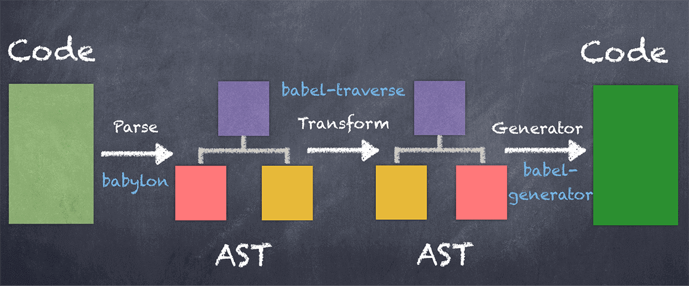
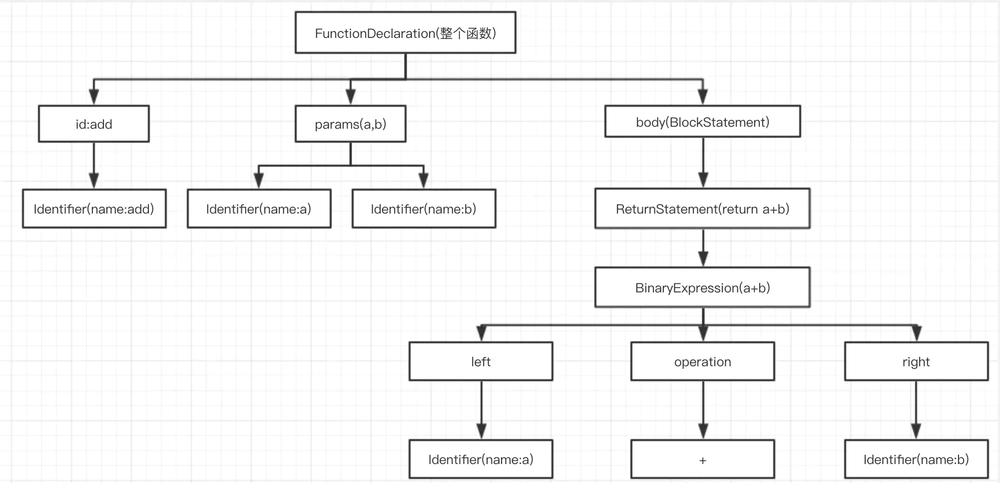

## 代码转译过程

code => AST => 修改AST => 编译后的code




### AST 定义

抽象语法树（Abstract Syntax Tree，AST）

```js
function add(a, b) {
   return a + b
}
```

转变成AST后是`ast1.json`



### AST 节点类型对照表

| 序号 | 类型原名称           | 中文名称      | 描述                                                  |
| ---- | -------------------- | ------------- | ----------------------------------------------------- |
| 1    | Program              | 程序主体      | 整段代码的主体                                        |
| 2    | VariableDeclaration  | 变量声明      | 声明一个变量，例如 var let const                      |
| 3    | FunctionDeclaration  | 函数声明      | 声明一个函数，例如 function                           |
| 4    | ExpressionStatement  | 表达式语句    | 通常是调用一个函数，例如 console.log()                |
| 5    | BlockStatement       | 块语句        | 包裹在 {} 块内的代码，例如 if (condition){var a = 1;} |
| 6    | BreakStatement       | 中断语句      | 通常指 break                                          |
| 7    | ContinueStatement    | 持续语句      | 通常指 continue                                       |
| 8    | ReturnStatement      | 返回语句      | 通常指 return                                         |
| 9    | SwitchStatement      | Switch 语句   | 通常指 Switch Case 语句中的 Switch                    |
| 10   | IfStatement          | If 控制流语句 | 控制流语句，通常指 if(condition){}else{}              |
| 11   | Identifier           | 标识符        | 标识，例如声明变量时 var identi = 5 中的 identi       |
| 12   | CallExpression       | 调用表达式    | 通常指调用一个函数，例如 console.log()                |
| 13   | BinaryExpression     | 二进制表达式  | 通常指运算，例如 1+2                                  |
| 14   | MemberExpression     | 成员表达式    | 通常指调用对象的成员，例如 console 对象的 log 成员    |
| 15   | ArrayExpression      | 数组表达式    | 通常指一个数组，例如 [1, 3, 5]                        |
| 16   | NewExpression        | New 表达式    | 通常指使用 New 关键词                                 |
| 17   | AssignmentExpression | 赋值表达式    | 通常指将函数的返回值赋值给变量                        |
| 18   | UpdateExpression     | 更新表达式    | 通常指更新成员值，例如 i++                            |
| 19   | Literal              | 字面量        | 字面量                                |
| 20   | BooleanLiteral       | 布尔型字面量  | 布尔值，例如 true false                               |
| 21   | NumericLiteral       | 数字型字面量  | 数字，例如 100                                        |
| 22   | StringLiteral        | 字符型字面量  | 字符串，例如 vansenb                                  |
| 23   | SwitchCase           | Case 语句     | 通常指 Switch 语句中的 Case                           |


#### [ast在线转换工具](https://astexplorer.net/)

### AST 能做什么？

1. 代码的转换 babel es6 => es5
2. 代码压缩混淆 uglify
3. 构建打包工具 webpack(plugin)
4. 一套代码转多端语言 uniapp taro mpvue


### 开发个小功能

#### 功能目的：console.log 输出是在哪里调用的

```js
function test() {
    console.log('i am run')
}
```

```js
//期望
function test() {
    console.log('test=>', 'i am run')
}
```


1. code => AST （parse阶段） @babel/parser

```js
const ast = jsparse(fileData)
```

2. 遍历AST @babel/traverse

`babel`提供了遍历`AST`节点的工具 `@babel/traverse`

```js
traverse(ast, visitor)
// 编写合适的访问者visitor，可以实现遍历任意节点
```


3. 判断AST节点类型 @babel/types

 - 找到调用表达式的节点 `CallExpression`

 - 判断调用表达式的调用节点是不是成员表达式 `MemberExpression`

 - 判断成员表达式的对象是`console` 成员属性是`log`

```js
const visitor = {
    CallExpression(path) {
        if (t.isMemberExpression(path.node.callee) && path.node.callee.object.name === 'console' && path.node.callee.property.name === 'log') {
            
        }
    }
}
```

4. 修改AST @babel/types

 - 往当前节点的父节点找，直到找到调用`console.log`的函数节点，并拿到该函数节点的`name`

 - 生成一个字符串节点

 - 往`console.log`的参数数组中，添加刚才生成的字符串节点
 

```js
const parent = path.findParent((path2) => {
    return t.isFunctionDeclaration(path2)
})
if (parent && parent.node.id.name) {
    const strNode = t.stringLiteral(`${parent.node.id.name}=>`)
    path.node.arguments.unshift(strNode)
}
```


5. AST转译成code @babel/generator

```js
generate(ast).code
```


### 小程序转vue（简单版）
 
 利用AST，做了一个简单版的小程序转vue工具，直接执行`node index.js`即可

